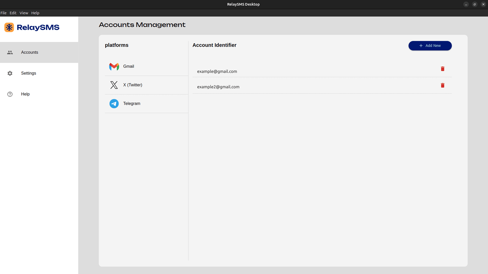

# RelaySMS - Desktop
--------

# 

RelaySMS Desktop is designed specifically for *vault* management. With this application, users can perform all vault-related actions, including:

- Signing up
- Logging in
- Storing tokens
- Deleting tokens
- Resetting passwords

**Note:** During sign-up and login, a One-Time Password (OTP) is sent to the user's phone for verification.

## Token Storage and Vault

RelaySMS utilizes a secure vault to store OAuth2 tokens for various services. These tokens allow you to access your accounts and send messages through these services without repeatedly entering your credentials.

Here's how the vault works:

 1. Token Encryption: When you grant RelaySMS access to a platform (e.g., Gmail), the app receives an OAuth2 token. This token is immediately encrypted using AES-256 with a unique key.

 2. Vault Storage: The encrypted token is then stored in the RelaySMS vault. The vault itself is protected by various security measures, including access controls and encryption. You can learn more about the vault specifications in the [documentation](https://github.com/smswithoutborders/SMSwithoutborders-BE/blob/main/docs/specifications.md).

 3. Token Retrieval: When you need to send a message through a service/platform, RelaySMS retrieves the encrypted token from the vault. It then decrypts the token and uses it to authenticate with the platform (e.g Gmail).

This secure token storage and retrieval process ensures that your sensitive credentials are never stored in plain text and are protected from unauthorized access.

## Installation

To install RelaySMS Desktop:

1. Download the latest version from [here](https://github.com/smswithoutborders/RelaySMS-Desktop/releases).
2. Follow the installation instructions for your operating system.
3. Launch the application and log in or sign up to start managing your vault.

## Contribution Guide

We welcome contributions to RelaySMS Desktop! Follow these steps to get started:

1. **Fork the Repository**: Clone your forked repository to your local machine.
2. **Install Dependencies**: Run `yarn install` .
3. **Create a Branch**: Use `git checkout -b feature-branch-name`.
4. **Make Changes**: Implement your changes and ensure the code is properly formatted.
5. **Test Your Changes**: Run tests to ensure everything works as expected.
6. **Push and Submit a PR**: Push your changes to your forked repository and create a Pull Request.
