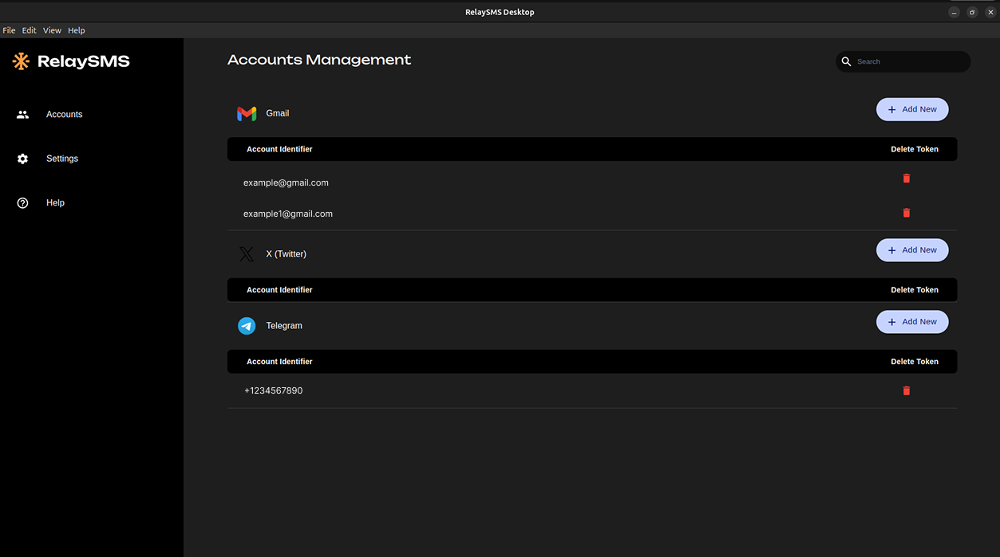

# RelaySMS - Desktop
--------

# 

RelaySMS Desktop is the desktop version of RelaySMS Mobile, designed specifically for *vault* management. With this application, users can perform all vault-related actions, including:

- Signing up
- Logging in
- Storing tokens
- Deleting tokens
- Resetting passwords

**Note:** During sign-up and login, a One-Time Password (OTP) is sent to the user's phone for verification.

## Installation

To install RelaySMS Desktop:

1. Download the latest version from [here](https://github.com/smswithoutborders/RelaySMS-Desktop/releases).
2. Follow the installation instructions for your operating system.
3. Launch the application and log in or sign up to start managing your vault.

## Contribution Guide

We welcome contributions to RelaySMS Desktop! Follow these steps to get started:

1. **Fork the Repository**: Clone your forked repository to your local machine.
2. **Install Dependencies**: Run `yarn install` (or relevant package manager for dependencies).
3. **Create a Branch**: Use `git checkout -b feature-branch-name`.
4. **Make Changes**: Implement your changes and ensure the code is properly formatted.
5. **Test Your Changes**: Run tests to ensure everything works as expected.
6. **Push and Submit a PR**: Push your changes to your forked repository and create a Pull Request.
